# Ejericicios Forty

[TOC]

## Trabajo en local

1. Inicializa un nuevo repositorio Git en una carpeta llamada  proporcionados en el aula virtual.

   ```bash
   $ git init
   $ git add .
   $ git commit -m "Carpeta forty creada, repositorio inicializado y archivos agregados"
   ```

   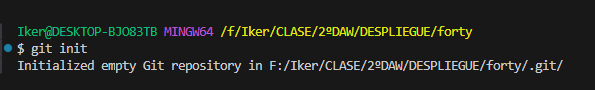
2. Renombra la rama master a  main

   ```bash
   $ git branch main
   $ git checkout main
   ```
3. Haz que los ficheros  README.txt, LICENSE.txt y  passwords.txt sean ignorados por el control  de versiones

   ```bash
   $ vim .gitignore
   README.txt
   LICENSE.txt
   passwords.txt
   $ git add .gitignore
   $ git commit -m "Archivo .gitignore creado"
   ```

   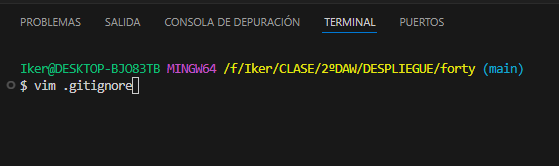

   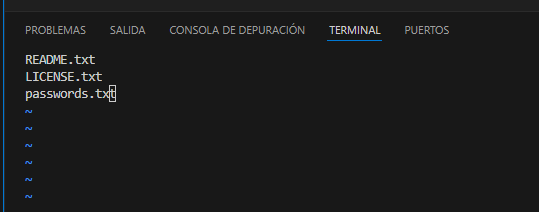
4. Crea el archivo  passwords.txt. Comprueba que el control de versiones lo ignora

   **Creo el archivo passwords.txt que podemos comprobar que existe en la carpeta forty y hacemos un git status sin haber hecho el `git add` y como podemos ver no sale nada**

   ```bash
   $ vim passwords.txt
   $ git status
   ```

   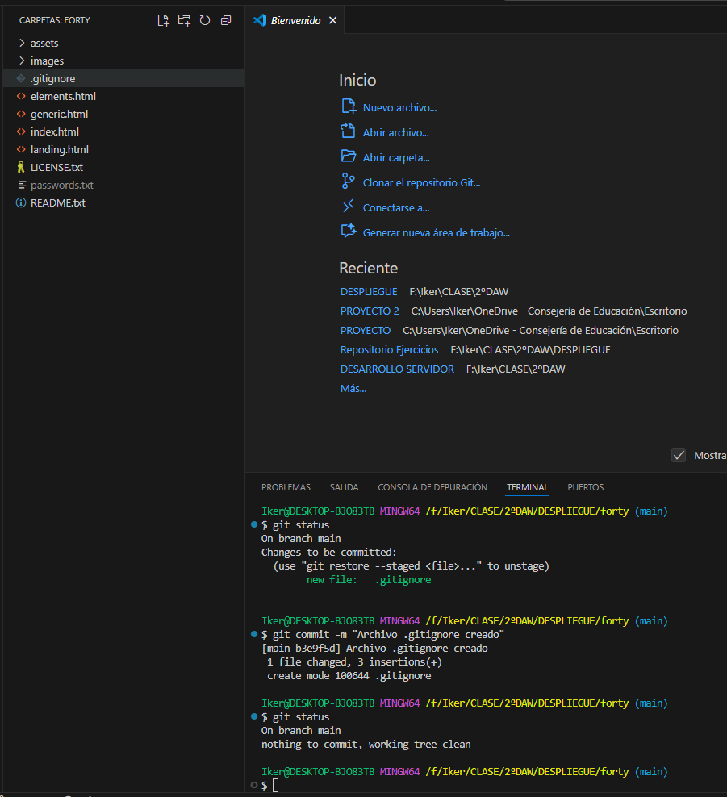
5. Crea una rama llamada  "feature-content".  Muévete a esa rama. Cambia, en la línea 3477, el  font-size por  1.5em en el archivo main.css. Confirma cambios y haz commit. Muestra los logs de la forma más gráfica posible.

   ```bash
   $ git branch feature-content
   $ git checkout feature-content
   $ vim +3477 assets/css/main.css
   $ git add .
   $ git commit -m "Archivo main editado desde la rama feature-content"
   ```

   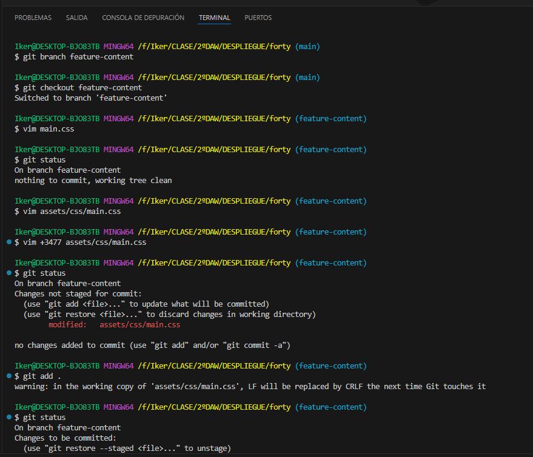

   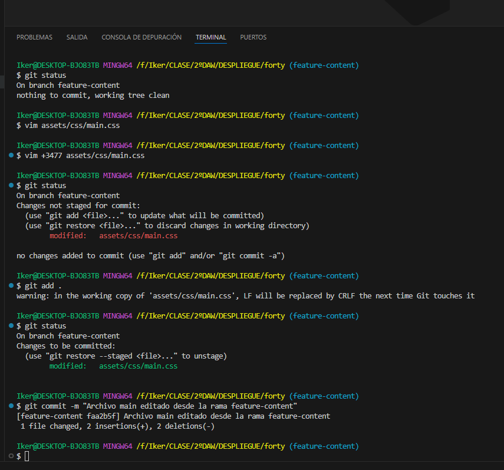
6. Elimina el archivo  "passwords.txt" en la carpeta  forty.  Verifica el estado del repositorio. ¿Hay cambios pendientes?

   ```bash
   $ rm passwords.txt
   $ git status
   ```

   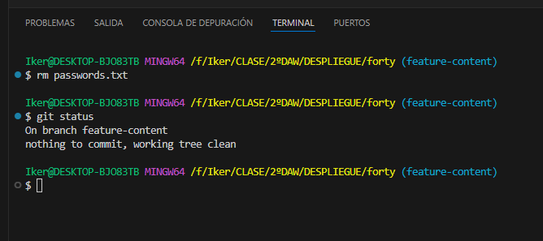
7. Crea un nuevo archivo llamado " about.html", partiendo del archivo generic.html y agrégalo al repositorio, haz un nuevo commit.

   ```bash
   $ cp generic.html about.html
   $ vim about.html
   $ git add about.html
   $ git commit -m "Archivo about.html creado a partir de generic.html"
   ```

   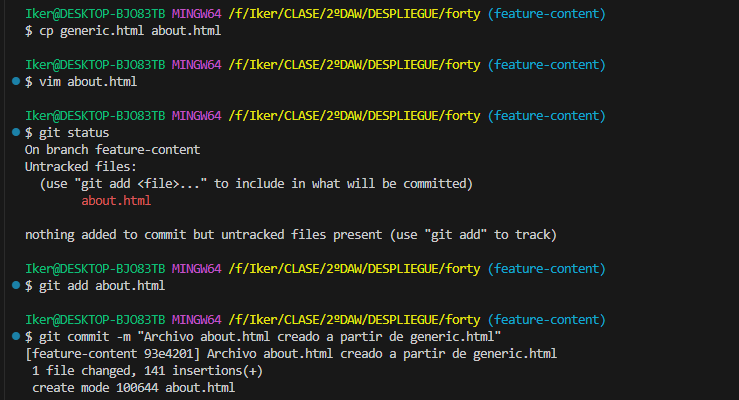
8. Cambia a la rama  main. Examina los logs del repositorio de forma gráfica.

   ```bash
   $ git log
   ```

   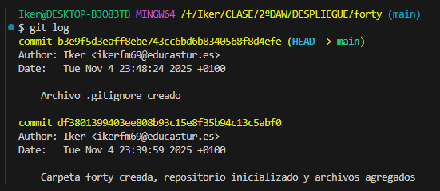

   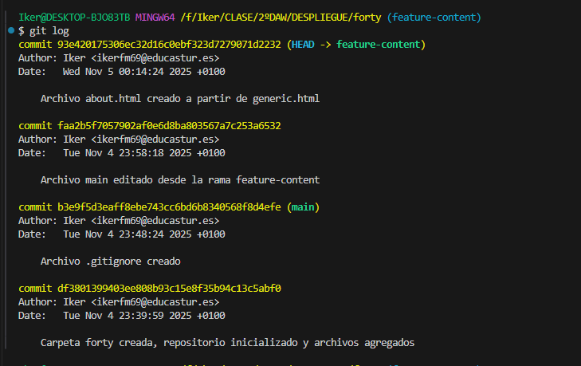
9. Modifica algo en el archivo  generic.html, comprueba que hay cambios, y realiza otro commit .  Examina los logs del repositorio de forma gráfica.

   ```bash
   $ vim generic.html
   $ git status
   $ git add generic.html
   $ git commit -m "Archivo generic modificado"

   ```

   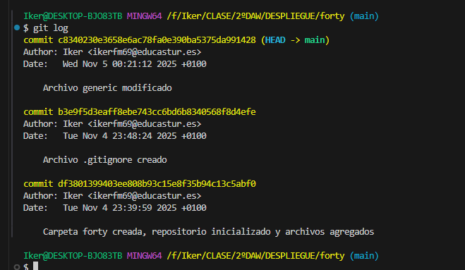
10. Modifica algo en el fichero  elements.html. Confirma los cambios, pero no hagas commit.

    ```bash
    $ vim elements.html
    $ git add elements.html
    ```

    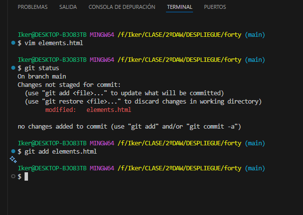
11. Mira las diferencias de  elements.html. Los cambios no nos gustan, deshaz los cambios de  elements.html. Comprueba que no hay cambios pendientes.

    ```bash
    $ git diff --staged elements.html
    $ git restore --staged elements.html
    $ git restore elements.html
    ```

    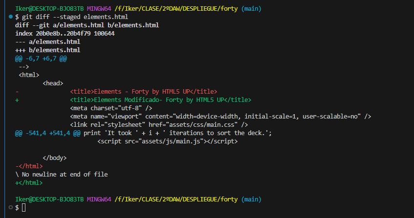

    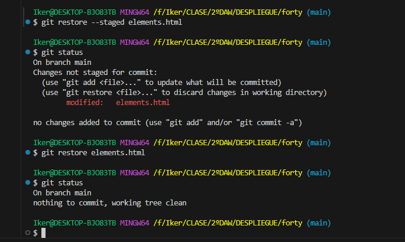
12. Muestra las diferencias entre dos ramas.

    ```bash
    $ git log
    $ git checkout feature-content
    $ git log
    ```

    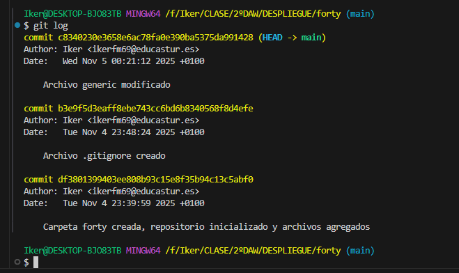

    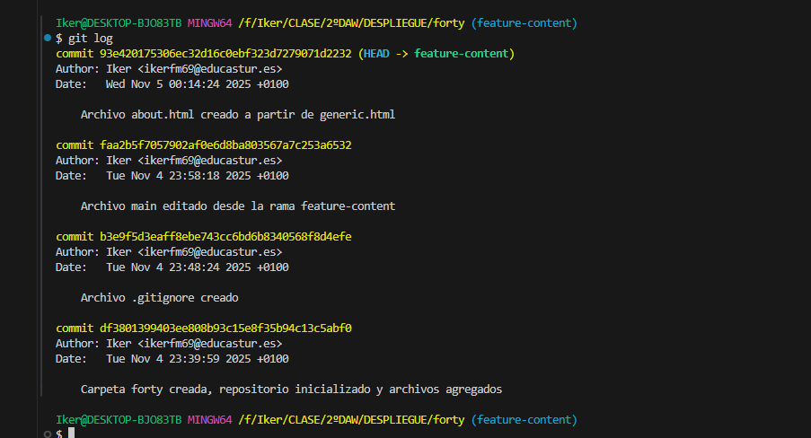
13. Fusiona la rama  "feature-content" con la rama principal (main). Muestra los logs del  repositorio de una forma gráfica y completa.

    ```bash
    $ git merge feature-content
    $ git log --graph --all --decorate --oneline
    ```

    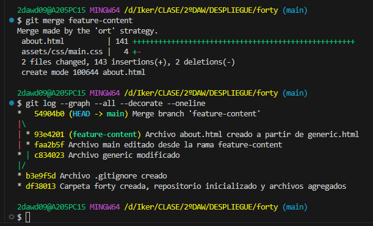
14. Crea una nueva rama llamada " hotfix" y en ella, corrige un error crítico en el archivo  "index.html". (Por ejemplo, añade el enlace a la nueva página about.html)

    ```bash
    $ git branch hotfix
    $ vim index.html
    $ git commit -m "Error de about solucionado en el archivo index.html"
    ```

    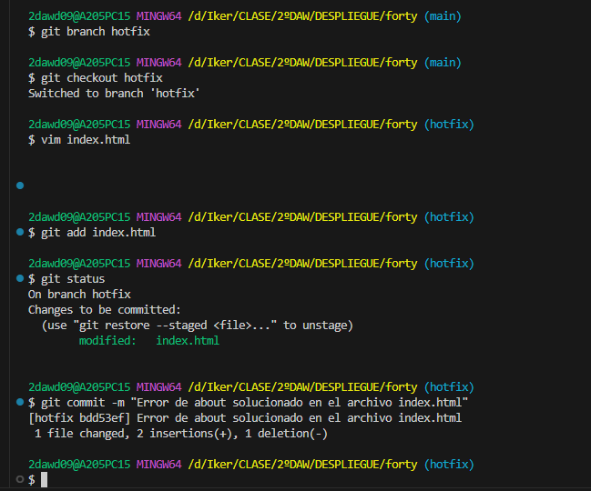
15. Fusiona la rama  "hotfix" con la rama principal y verifica el historial de commits de forma que se  vean todas las ramas gráficamente. ¿Borrarías la rama  hotfix? ¿En qué caso? ¿Cómo?

    ```bash
    $ git checkout main
    $ git merge hotfix
    $ git log --graph --all --decorate --oneline
    ```

    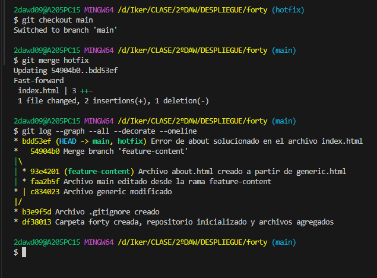

    **La borraría localmente si no hay trabajo pendiente y sus cambios ya estuviesen en el main y la borraría con el comando:**

    ```bash
    $ git branch -d hotfix
    ```
16. Muestra el historial de cambios limitado a los últimos 3 commits.

    ```bash
    $ $ git log -n 3
    ```

    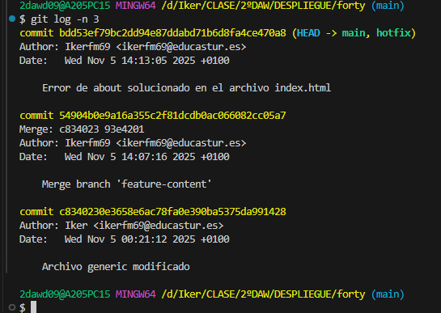
17. Etiqueta el commit actual como "v1.0" y muestra las etiquetas existentes.

    ```bash
    $ git tag -a v1.0 -m "Error de about solucionado en el archivo index.html"
    $ git log --graph --decorate --oneline --all --tags
    ```


    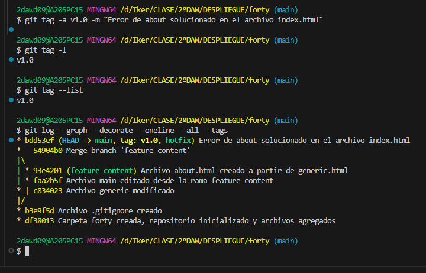

## Trabajo en remoto

1. Sube al remoto los ficheros de tu repositorio local.

   ```bash
   $ git remote add origin https://github.com/Ikerfm69/forty.git
   $ git branch -M main
   $ git push -u origin main
   ```
   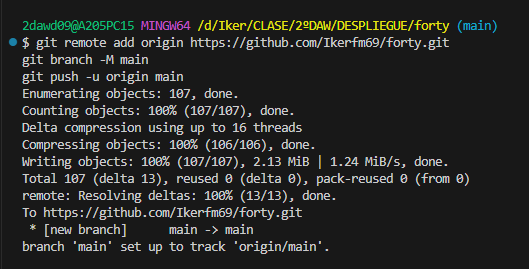
2. En local, crea una rama 'feature-head'. Cambia el título en la sección head de index.html , borra los comentarios del head , o previos, también. Confirma y sube los cambios al remoto.

   ```bash
   $ git branch feature-head
   $ git checkout feature-head
   $ vim index.html
   $ git add index.html
   $ git commit -m "Titulo del index modificado"
   $ git push -u origin feature-head
   ```
   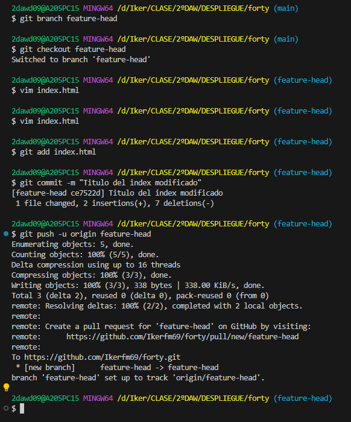
3. En remoto, crea una rama 'feature-articulo'. Duplica la página generic , nómbrala como articulo.html , y añade como contenido un artículo sobre Git. Confirma los cambios y realiza un commit. Muestra los commits del repositorio tal como se ven en GitHub.

   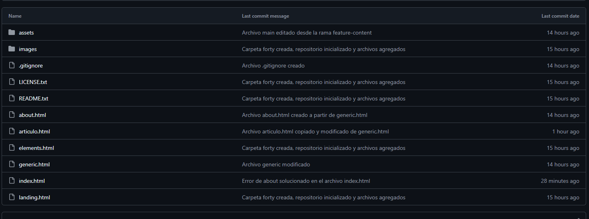
4. En el repositorio local examina los cambios. Actualiza el repositorio con el remoto. Fusiona en 'main' las dos ramas 'feature'. Crea la etiqueta 'v2.0'. Muestra los logs, commits, etiquetas y ramas actuales, en local y en remoto.

   ```bash
   $ git log
   ```
   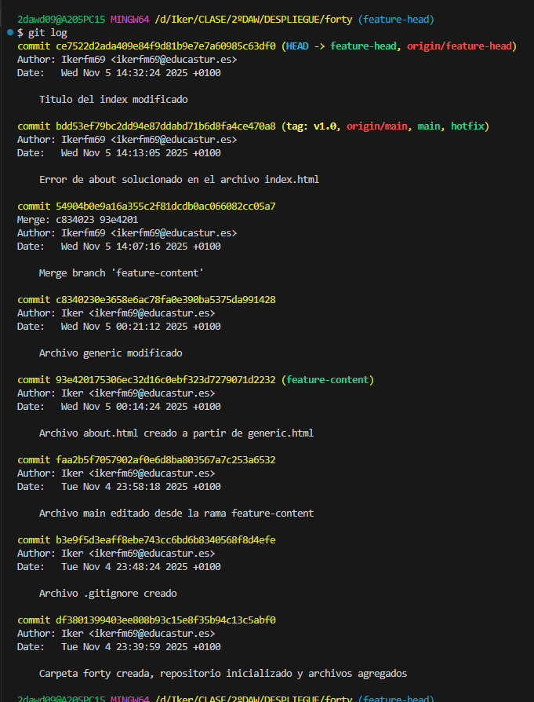

   ```bash
   $ git checkout main
   $ git fetch origin --prune
   $ git merge origin/feature-articulo -m "Ramas main y feature-articulo f
   usionadas"

   ```
   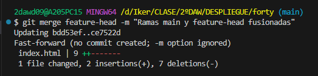

   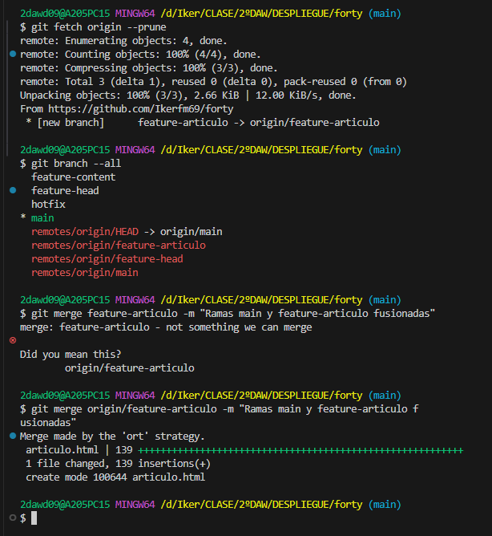

   ```bash
   $ git tag -a v2.0 -m "Version 2.0"
   $ git log --graph --decorate --oneline --all --tags
   ```
   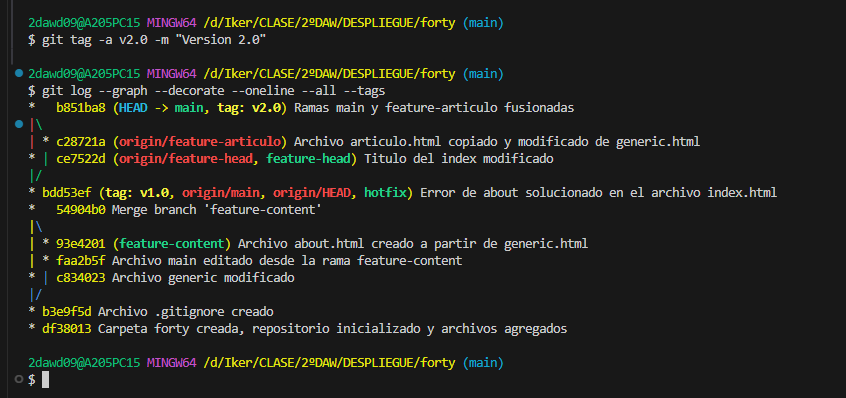
5. En tu copia local, crea una rama nueva . En la rama nueva, cambia los enlaces de la página index.html para que apunten correctamente a la nueva página articulo.html . Confirma los cambios.

   ```bash
   $ git branch feature-index
   $ git checkout feature-index
   $ vim index.html
   $ git add index.html
   ```
   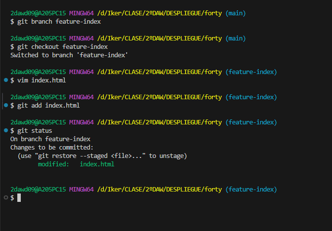
6. Muestra los logs de forma que se vean las ramas en tu copia local.

   ```bash
   $ $ git log --graph --decorate --oneline --all --tags
   ```
   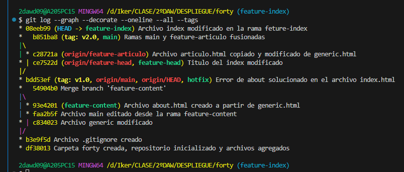
7. Te gusta el resultado de los cambios. Incorpora los cambios de la rama nueva a la principal.

   ```bash
   $ git checkout main
   $ git merge feature-index -m "Ramas main y feture-index fusionadas"
   ```
   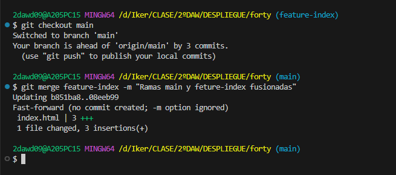
8. Sube los cambios al remoto borrando la rama nueva , si es necesario. Comprueba primero con un comando en local, las ramas que hay en el repositorio remoto.

   ```bash
   $ git branch -d feature-index
   $ git ls-remote --heads origin
   $ git push -u origin main
   ```
   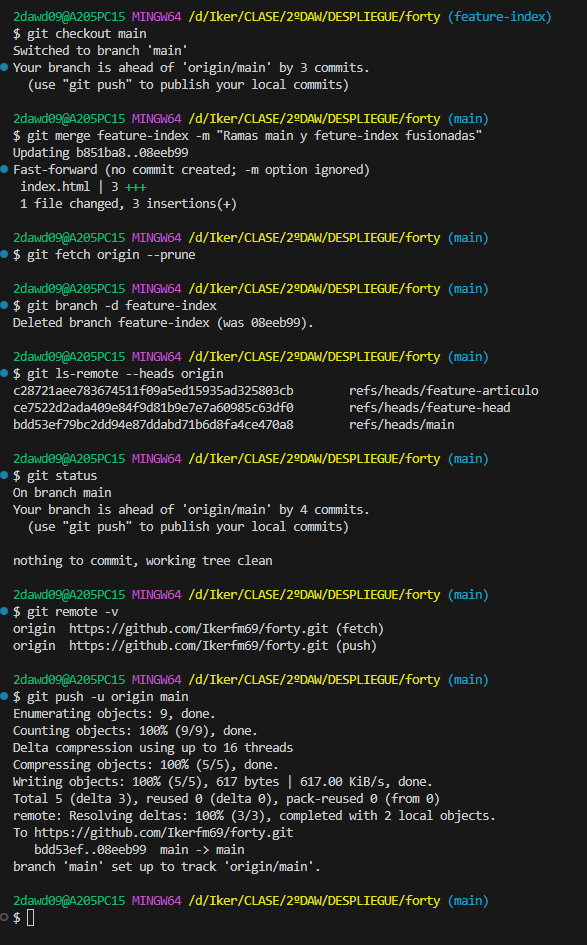
9. Muestra en local los cambios en el archivo index.html entre la versión actual y la anterior.

   ```bash
   $ git diff HEAD~1 HEAD -- index.html
   ```
   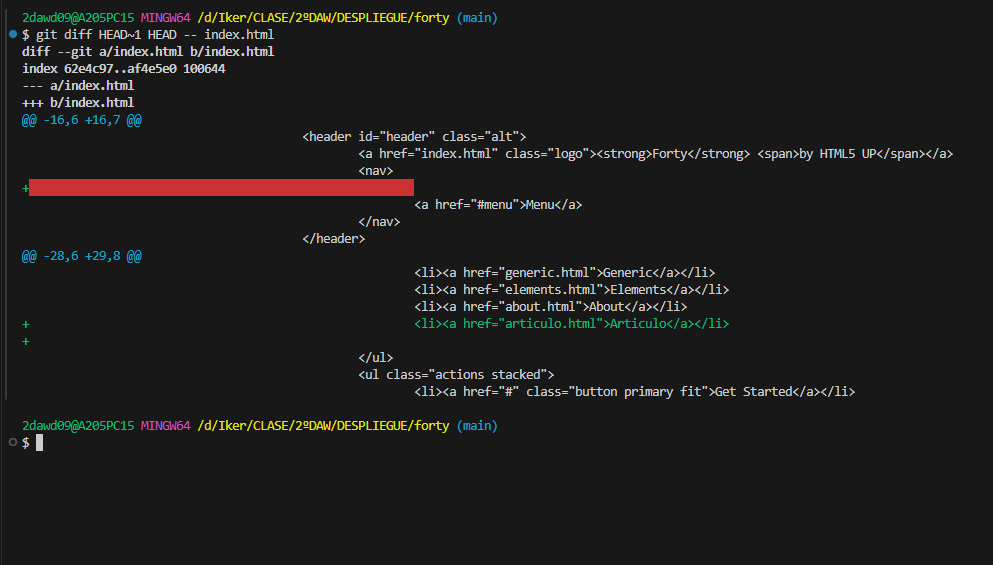
10. En el repositorio en GitHub, navega hasta el archivo index.html y selecciona la opción "History".

    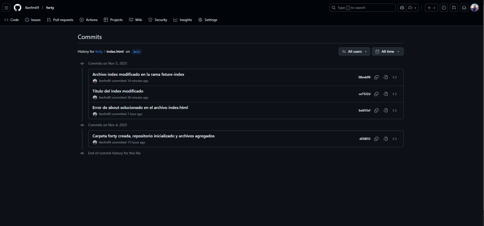
