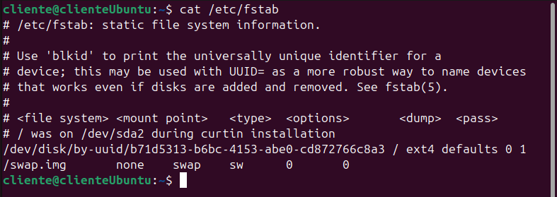

# Ejercicios Linux - Capítulo 2

[TOC]

## Comandos utilizados


## Directorios


## Ejercicios

1. ¿En qué directorio se encuentran los ficheros de configuración de sistema?

   **Se encuentran en el fichero `/etc`**

   ```bash
   $ ls /etc
   ```

   

   

2. Para entrar en un sistema Linux hace falta a) nombre de usuario, contraseña y dirección IP, b) nombre de usuario y contraseña o c) únicamente una contraseña.

   **b) Nombre de usuario y contraseña**

   

3. Muestra el contenido del directorio actual.

   ```bash
   $ ls
   ```

   

4. Muestra el contenido del directorio que está justo a un nivel superior. 

   ```bash
   $ ls ..
   ```

   

5. ¿En qué día de la semana naciste?, utiliza la instrucción cal para averiguarlo.

   ```bash
   $ cal noviembre 2005
   ```

   

6. Muestra los archivos del directorio /bin

   ```bash
   $ ls /bin
   ```

   

   

7. Suponiendo que te encuentras en tu directorio personal (/home/nombre), muestra un listado del contenido de /usr/bin a) con una sola línea de comando, b) moviéndote paso a paso por los directorios y c) con dos líneas de comandos.

   **a) Se muestra con el código `ls /usr/bin`**

   ```bash
   $ ls /usr/bin
   ```

   

   **b)Voy primero a la carpeta`/usr`y luego a la carpeta`/usr/bin` y desde ahí lo muestro con `ls /usr/bin`**

   ```bash
   $ cd /usr
   ```

   ```bash
   $ cd /usr/bin
   ```

   ```bash
   $ ls
   ```

   

   **c)Primero muestro lo que hay en la carpeta `/usr` y luego lo que hay en la carpeta `/usr/bin`**

   ```bash
   $ cd /usr/bin
   ```

   ```bash
   $ ls 
   ```

   

   

8. Muestra todos los archivos que hay en /etc y todos los que hay dentro de cada subdirectorio, de forma recursiva (con un solo comando).

   ```bash
   $ ls -l /etc
   ```

   

9. Muestra todos los archivos del directorio /usr/X11R6/bin ordenados por tamaño (de mayor a menor). Sólo debe aparecer el nombre de cada fichero, sin ninguna otra información adicional.

   ```bash
   $ ls -shS /usr/bin/X11
   ```

   

10. Muestra todos los archivos del directorio /etc ordenados por tamaño (de mayor a menor) junto con el resto de características, es decir, permisos, tamaño, fechas de la última modificación, etc. El tamaño de cada fichero debe aparecer en un formato “legible”, o sea, expresado en Kb, Mb, etc.

    ```bash
    $ ls -lhS /etc
    ```

    

11. Muestra todos los archivos del directorio /bin ordenados por tamaño (de menor a mayor). Sólo debe aparecer el tamaño y el nombre de cada fichero, sin ninguna otra información adicional. El tamaño de cada fichero debe aparecer en un formato “legible”, o sea, expresado en Kb, Mb, etc.

    ```bash
    $ ls -shS /usr/bin
    ```

    

12. Muestra el contenido del directorio raíz utilizando como argumento de ls una ruta absoluta.

    ```bash
    $ ls /
    ```

    

13. Muestra el contenido del directorio raíz utilizando como argumento de ls una ruta relativa. Suponemos que el directorio actual es /home/elena/documentos. 

    ```bash
    $ ls /home/cliente/Documentos/
    ```

    

14. Crea el directorio gastos dentro del directorio personal.

    ```bash
    $ mkdir gastos
    ```

     

15. ¿Qué sucede si se intenta crear un directorio dentro de /etc? 

    Te da el permiso denegado

    ```bash
    $ cd /etc
    $ mkdir DirectorioPrueba
    ```

    

16. Muestra el contenido del fichero /etc/fstab .  

    ```bash
    $ cat /etc/fstab
    ```

    

17. Muestra las 10 primeras líneas del fichero /etc/bash.bashrc

    ```bash
    $ head /etc/bash.bashrc
    ```

    

18. Crea la siguiente estructura de directorios dentro del directorio de trabajo personal: 

    multimedia | -------------------------------------------------- | | | | musica imagenes video presentaciones | -------------- | | personales otras

    ```bash
    $ mkdir multimedia
    $ cd multimedia
    $ mkdir musica
    $ mkdir video
    $ mkdir presentaciones
    $ mkdir imagenes
    $ cd imagenes
    $ mkdir personales
    $ mkdir otras
    ```

    

19. Crea un fichero vacío dentro del directorio musica, con nombre estilos_favoritos.txt

    ```bash
    $ cd multimedia/musica
    $ touch estilos_favoritos.txt
    ```

    

20. Utiliza tu editor preferido para abrir el fichero estilos_favoritos.txt e introduce los estilos de música que más te gusten. Guarda los cambios y sal. 

    ```bash
    $ nano estilos_favoritos.txt
    ```

    

21. Muestra todo el contenido de estilos_favoritos.txt 

    ```bash
    $ cat estilos_favoritos.txt
    ```

    

22. Muestra las 3 primeras líneas de estilos_favoritos.txt 

    ```bash
    $ head -n3 estilos_favoritos.txt
    ```

    

23. Muestra la última línea de estilos_favoritos.txt 

    ```bash
    $ tail -n1 estilos_favoritos.txt
    ```

    

24. Muestra todo el contenido del fichero estilos_favoritos.txt excepto la primera línea. Se supone que no sabemos de antemano el número de líneas del fichero.

    

```bash
$ tail -n+2 estilos_favoritos.txt
```

