# Ejercicios Linux - Capítulo3

[TOC]

## Símbolos

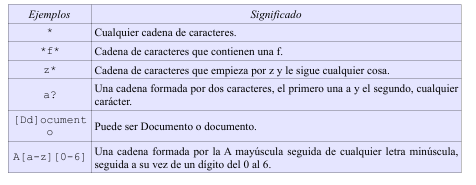


## Comandos

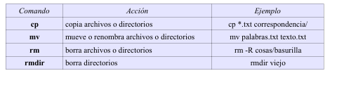

## Ejercicios

1. Muestra todos los archivos del directorio actual que son imágenes jpg.

   ```bash
   $ ls *.jpg
   ```

   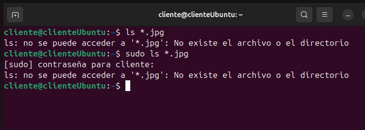

2. Muestra todos los archivos del directorio /usr/bin que empiecen por la letra j.

   ```bash
   $ ls /usr/bin/j*
   ```

   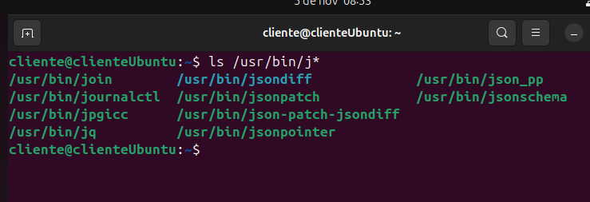

3. Muestra   los   archivos   que   empiecen   por  k  y   tengan   una   a   en   la  tercera   posición,   dentro   del directorio /usr/bin.

   ```bash
   $ ls /usr/bin/k?a*
   ```

   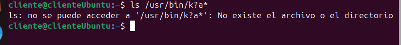

4. Muestra los archivos del directorio /bin que terminen en n.

   ```bash
   $ ls /bin/*n
   ```

   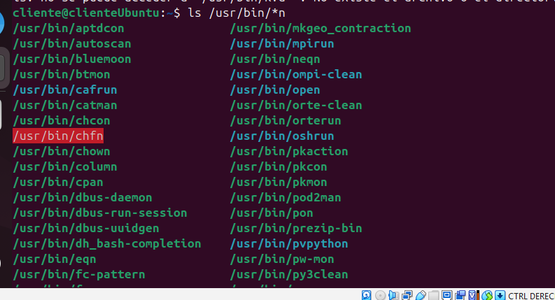

5. Muestra todos los archivos que hay en /etc y todos los que hay dentro de cada subdirectorio, de forma  recursiva. 

   ```bash
   $ ls -R /etc
   ```

   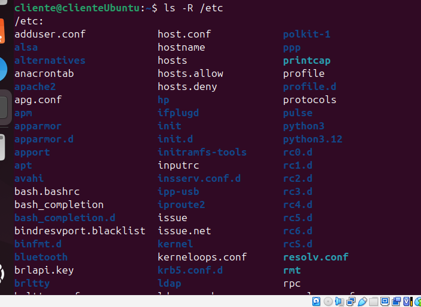

6. Crea un directorio en tu directorio de trabajo con nombre prueba. Copia el archivo gzip del directorio  /bin  al directorio  prueba. Crea un duplicado de  gzip  con nombre  gzip2  dentro de prueba.

   ```bash
   $ mkdir prueba 
   $ cp /bin/gzip prueba 
   $ cd prueba/ 
   /prueba$ cp gzip gzip2
   ```

   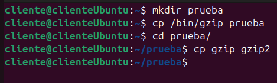

7. Cambia el nombre de prueba a prueba2. Crea prueba3 en el mismo nivel que prueba2 y mueve todos los ficheros de prueba2 a prueba3. Borra prueba2. 

   ```bash
   /prueba$ cd .. 
   $ mv prueba prueba2 
   $ mkdir prueba3 
   $ mv prueba2/* prueba3/ 
   $ rmdir prueba2
   ```

   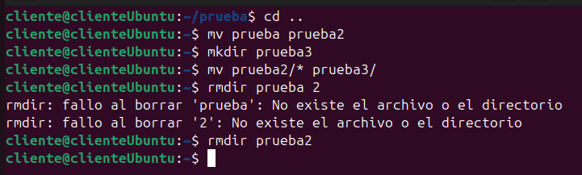

8. Crea un fichero vacío con nombre “*?Hola caracola?*”. ¿Se puede? En caso de que se pudiera, ¿sería recomendable poner nombres así? Razona la respuesta.

   **Sí, se puede hacer utilizando la barra invertida para indicar los caracteres especiales: touch \*\?Hola\ caracola\?\* **

   **No es nada recomendable utilizar caracteres extraños que se pueden confundir con símbolos comodín. Tampoco es recomendable utilizar espacios en blanco. En su lugar, se recomienda utilizar el carácter de subrayado "_".**

   ```bash
   $ touch \?Hola\ caracola\?
   ```

9. Crea un directorio con nombre multimedia_pruebas y copia en él todo el contenido del directorio  multimedia.  A  continuación   crea   en  multimedia/video/  dos   ficheros,   uno   con nombre peliculas.txt y otro con nombre actores.txt. Edita el fichero peliculas.txt e introduce   el   nombre   de   tu   película   favorita.  A   continuación,   crea   en multimedia_pruebas/video/ otro fichero que también tenga por nombre peliculas.txt, edítalo  y esta vez escribe el nombre de tus cinco películas favoritas. Ahora haz una copia de todo el contenido   de  multimedia  en  multimedia_prueba  de   tal   forma   que   sólo   se   copien   los contenidos nuevos, es decir, si hay coincidencia en el nombre de un archivo se respetará el que se haya modificado más recientemente. Para comprobar que se ha hecho todo correctamente, basta mirar si en multimedia_prueba/video  está   el   archivo   vacío  actores.txt  y   además   el   archivo peliculas.txt debe contener 5 películas y no 1.

   ```bash
   $ mkdir multimedia_pruebas 
   $ cp -R multimedia/* multimedia_pruebas/ 
   $ cd multimedia /video/ 
   /multimedia/video$ touch peliculas.txt actores.txt 
   /multimedia/video$ vi peliculas.txt 
   /multimedia/video$ cd 
   $ cd multimedia_pruebas/video/ 
   /multimedia_pruebas/video$ vi peliculas.txt 
   /multimedia_pruebas/video$ cd 
   $ cp -Ru multimedia/* multimedia_pruebas/
   ```

   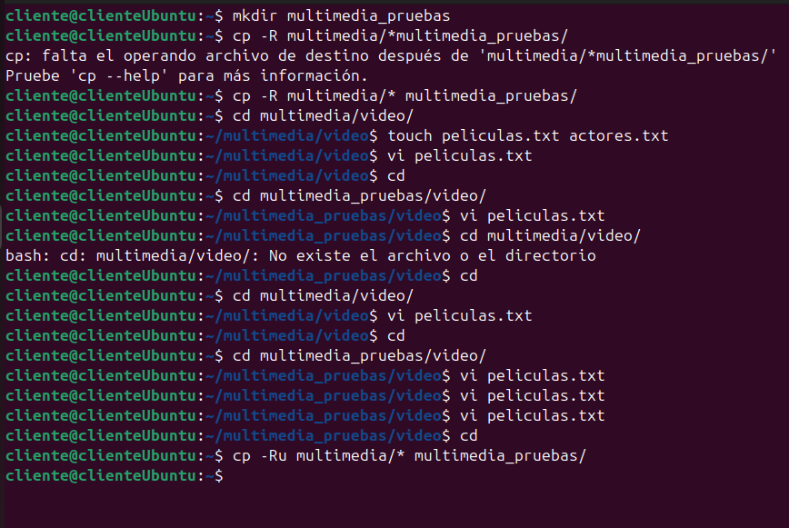

10. Borra el directorio multimedia/imagenes/otras. El sistema debe pedir al usuario que confirme el  borrado. 

    ```bash
    $  rm -Ri multimedia/imagenes/otras/
    ```

    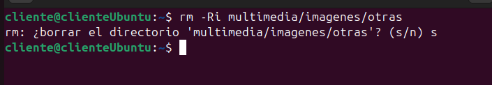

11. Mueve el archivo peliculas.txt, que está dentro de multimedia/video, al directorio que está justo  a un nivel superior. Ahora el archivo debe llamarse mis_peliculas.txt en lugar de películas.

    ```bash
    $ cd multimedia/video/ 
    /multimedia/video$ mv peliculas.txt ../mis_peliculas.txt
    ```

    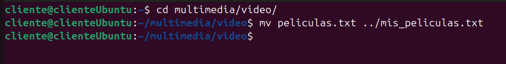