# Ejercicios Linux - Capítulo 4


[TOC]

## Comandos

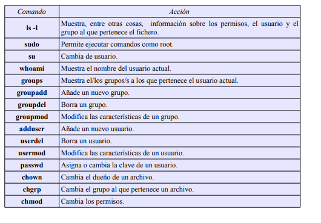

1. Completa la siguiente tabla:

   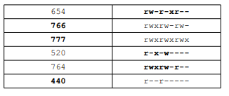

2. Crea los grupos oficina1 y oficina2.

   ```bash
   $# groupadd oficina1
   $# groupadd oficina2
   ```

   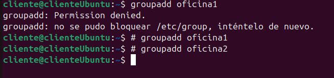

3. Crea los usuarios paco y pablo. Estos usuarios deben pertenecer únicamente al grupo oficina1. 

   ```bash
   $sudo adduser paco --ingroup oficina1
   $sudo adduser pablo --ingroup oficina1
   ```

   

4. Crea los usuarios alba y nerea. Estos usuarios deben pertenecer únicamente al grupo oficina2. 

   ```bash
   $sudo adduser paco --ingroup oficina1
   $sudo adduser pablo --ingroup oficina1
   ```

   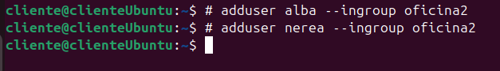

5. Como usuario paco Crea un fichero con nombre topsecret.txt en su directorio de trabajo al que únicamente él tenga acceso, tanto de lectura como de escritura. 

   ```bash
   $ su paco 
   $ cd 
   $ touch top_secret.txt 
   $ chmod 600 top_secret.txt 
   ```

   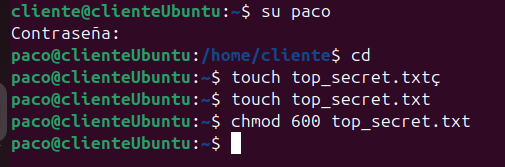

6. Crea otro fichero, también como usuario paco, con nombre ventas_trimestre.txt al que tengan acceso, tanto para leer como para escribir todos los usuarios que pertenezcan al mismo grupo. Se deben dejar los permisos que haya por defecto para el dueño y para el resto de usuarios. Comprueba como usuario pablo que puedes modificar el fichero. 

   ```bash
   $ touch ventas_trimestre.txt 
   $ chmod g+rw ventas_trimestre.txt
   Comprobamos que el usuario pablo puede modificar este fichero, ya que es miembro del mismo grupo:
   $ exit
   $ su pablo 
   $ vi /home/paco/ventas_trimestre.txt
   ```

   

   

7. Como usuario alba, crea un fichero con nombre empleados.txt al que pueda acceder cualquier usuario para leer su contenido, y cualquier usuario del mismo grupo para leer o escribir. 

   ```bash
    $ exit 
   $ su alba 
   $ cd 
   $ touch empleados.txt 
   $ chmod 664 empleados.txt 
   ```

   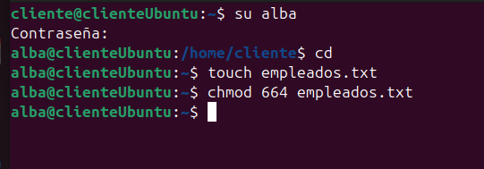

8. Copia el fichero empleados.txt al directorio de trabajo de alumno (crea también el usuario alumno si no está creado). Cambia el propietario y el grupo al que pertenece el fichero, ahora debe ser alumno.

   ```bash
   $ exit
   $ sudo cp /home/alba/empleados.txt /home/alumno/ 
   $ sudo chown alumno /home/alumno/empleados.txt 
   $ sudo chgrp alumno /home/alumno/empleados.txt
   ```

   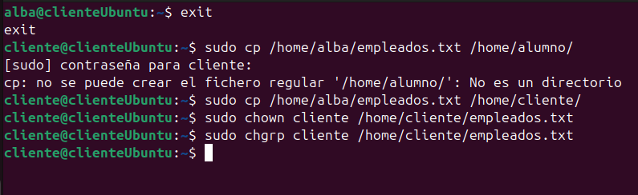

9. Como usuario pablo, copia un programa del directorio /usr/bin al directorio de trabajo con un nombre diferente. Por ejemplo xclock se puede copiar como reloj. Mira los permisos de este programa. Comprueba que se puede ejecutar. Puede que sea necesario dar permiso para que otros usuarios distintos al actual puedan ejecutar aplicaciones en el entorno gráfico, basta con ejecutar como administrador: xhost +.

   ```bash
   $ su pablo
   /home/luisjose$ cd 
   $ cp /usr/bin/xclock reloj
   $ ls -l
   total56
   -rwxr-xr-x 1 pablo oficina1 54336 nov 5 09:41 reloj
   $ ./reloj
   ```

   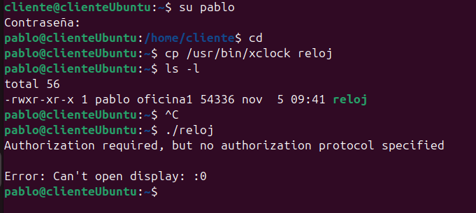

10. Cambia los permisos de reloj de tal forma que sólo lo pueda ejecutar el propietario del archivo.

    ```bash
     $ chmod go-x reloj
    ```

    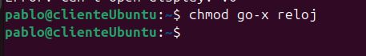

11. Crea el usuario modesto, perteneciente a oficina2. Dentro de su directorio de trabajo, crea un directorio de nombre compartido_con_todos. 

    ```bash
    $ exit 
    $ sudo adduser modesto --ingroup oficina2 
    $ su modesto 
    $ cd 
    $ mkdir compartido_con_todos
    ```

    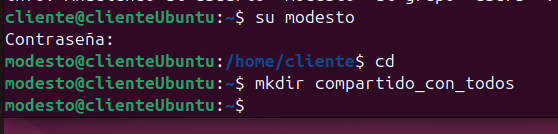

12. Cambia de usuario en el entorno gráfico (botón salir y botón cambiar de usuario) y entra como modesto. Crea con OpenOffice.org Calc los ficheros telefono_contactos.ods, gastos_marzo.ods y sueldos.ods. Inserta varias entradas en cada uno de los ficheros y grábalo todo en el directorio compartido_con_todos. 

    **Se puede acceder al programa Calc mediante Aplicaciones → Oficina → OpenOffice.org Cal Hoja de cálculo.**

    

13. Da permiso de lectura a la carpeta compartido_con_todos y a todos los ficheros que contenga para todos los usuarios. 

    ```bash
    $ chmod -R a+r compartido_con_todos
    ```

    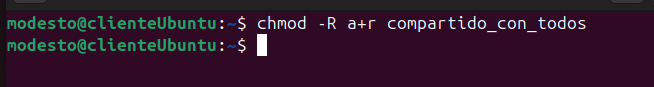

14. Restringe el acceso de escritura sobre el fichero telefono_contactos para que sólo lo puedan modificar los usuarios del grupo al que pertenece su propietario. 

    ```bash
    $ cd compartido_con_todos
    $ chmod g+w telefono_contactos.ods
    $ chmod o-w telefono_contactos.ods
    ```

    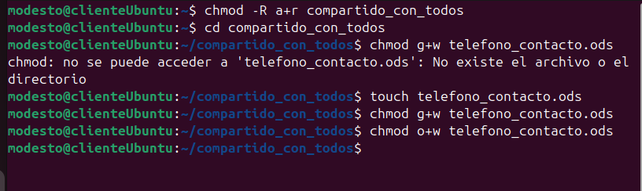

15. Cambia los permisos de gastos_marzo para que sólo pueda modificarlo su propietario y leerlo cualquiera del mismo grupo. 

    ```bash
    $ chmod 640 gastos_marzo.ods
    ```

    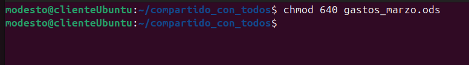

16. Cambia los permisos de sueldos para que sólo su dueño tenga acceso a él, tanto para lectura como para escritura. 

    ```bash
     $ chmod 600 sueldos.ods
    ```

    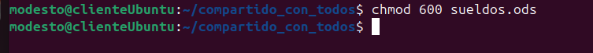

17. Si un usuario tiene permiso de lectura sobre un fichero pero ese fichero se encuentra dentro de un directorio sobre el que no tiene permiso de lectura, ¿podrá leer el fichero?, haz la prueba.

    **No. Un usuario que no tenga privilegios de lectura sobre un directorio no puede acceder a los ficheros contenidos en ese directorio, aunque esos ficheros tengan todos los permisos activados, p. ej. con 777.**

    

