# Ejercicios de comandos de Red en Linux


[TOC]

## Ejercicios

1. **Muestra todas las interfaces de red activas y sus direcciones IP en el sistema.**

   ```bash
   $ ip addr show
   ```

   

2. **¿Cómo mostrarías solo la información de la interfaz de red `eth0` usando `ip a`?**

   ```bash
   $ ip addr show dev enp0s3
   ```

   

3. **Configura manualmente la dirección IP `192.168.1.100/24` en la interfaz `eth0` con `ifconfig`.**

   ```bash
   sudo ifconfig eth0 192.168.1.100 netmask 255.255.255.0 up
   ```

   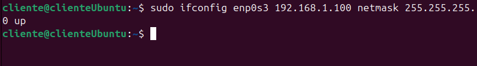

4. **Envía 10 paquetes ICMP a la dirección IP `8.8.8.8` usando `ping`.**

   ```bash
   $ sudo ping -c 10 8.8.8.8
   ```

   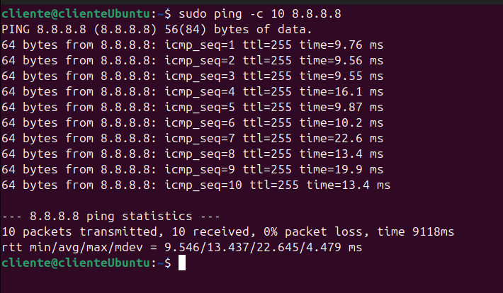

5. **Consulta la dirección IP de `www.example.com` usando `nslookup`.**

   ```bash
   $ nslookup www.example.com
   ```

   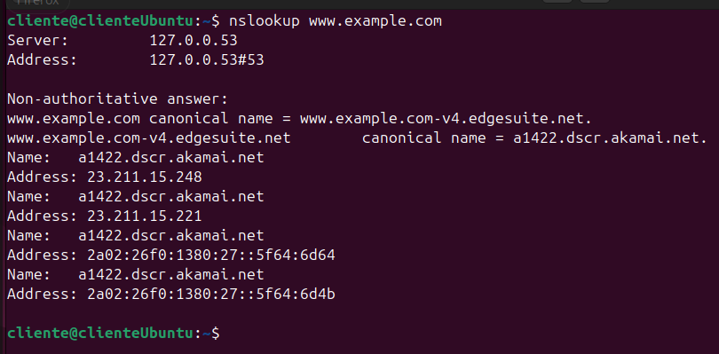

6. **Muestra las conexiones TCP activas en el sistema usando `netstat`.**

   ```bash
   $ sudo netstat -tp
   ```

   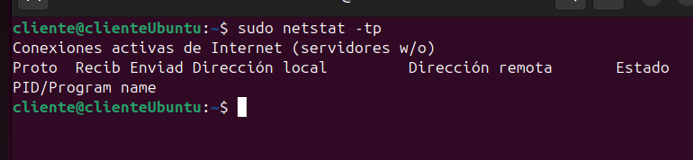

7. **Descarga el contenido de la página principal de `www.example.com` usando `curl` y guárdalo en un archivo llamado `example.html`.**

   ```bash
   $ curl -sS https://www.example.com -o example.html
   ```

   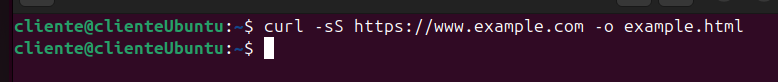

8. **Consulta el nombre del host actual del sistema.**

   ```bash
   $ hostname
   ```

   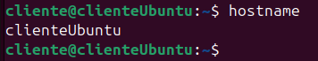

9. **Obtén la información de registro del dominio `example.com` usando `whois`.**

   ```bash
   $ whois example.com
   ```

   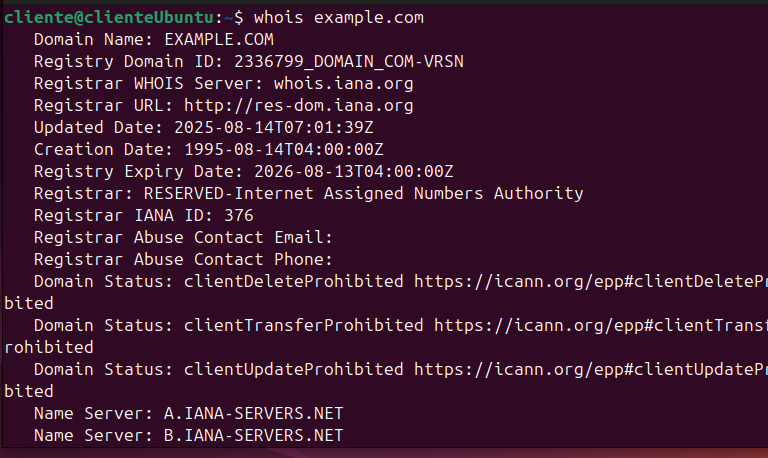

10. **Cambia temporalmente el nombre del host a `servidor01` usando `hostname`.**

    ```bash
    $ sudo hostname servidor01
    ```

    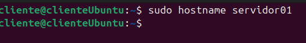

11. **Envía un ping a la dirección `192.168.1.1` y muéstralo en modo detallado (verbose).**

    ```bash
    $ ping -v 192.168.1.1
    ```

    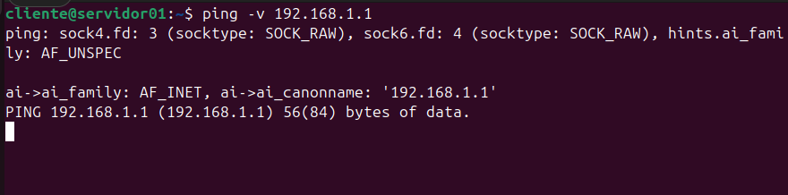

12. **Muestra las estadísticas de la red, como la cantidad de paquetes transmitidos, usando `netstat`.**

    ```bash
    $ netstat -s
    ```

    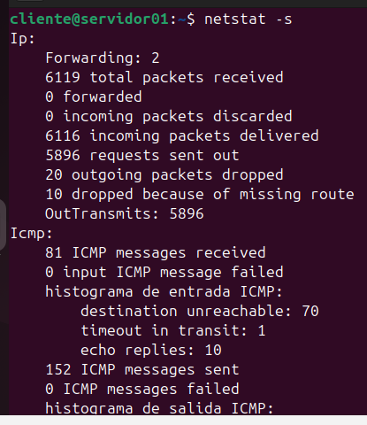

13. **Realiza una consulta inversa para obtener el nombre de dominio asociado a la IP `8.8.8.8` con `nslookup`.**

    ```bash
    $ nslookup 8.8.8.8
    ```

    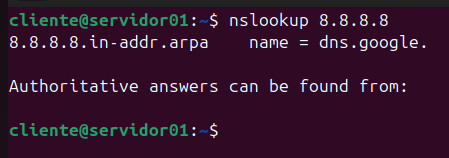

14. **Configura temporalmente la máscara de subred `255.255.255.128` en la interfaz `eth1` usando `ifconfig`.**

    ```bash
    $ sudo ifconfig enp0s3 192.168.1.130 netmask 255.255.255.128 up
    ```

    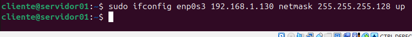

15. **Muestra las rutas de enrutamiento actuales usando `netstat`.**

    ```bash
    $ netstat -rn
    ```

    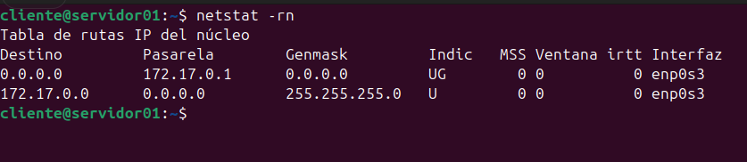

16. **Realiza una solicitud HTTP GET a la API de GitHub para obtener los repositorios de `usuario123` usando `curl`.**

    ```bash
    $ curl -sS https://api.github.com/users/usuario123/repos
    ```

    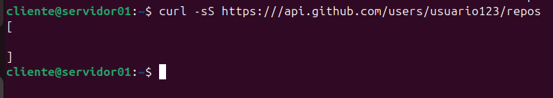

17. **Envía un ping a la dirección `2001:4860:4860::8888` (IPv6 de Google) con `ping6` y limita los paquetes a 4.**

    ```bash
    $ ping6 -c 4 2001:4860:4860::8888
    ```

    

18. **Obtén las estadísticas de los sockets activos en el sistema con `netstat`.**

    ```bash
    $ netstat -s
    ```

    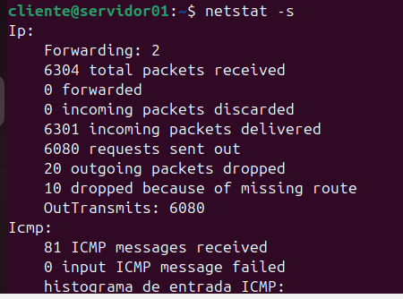

19. **Cambia temporalmente la dirección MAC de la interfaz `eth0` a `00:11:22:33:44:55` usando `ifconfig`.**

    ```bash
    $ sudo ifconfig eth0 down
    $ sudo ifconfig eth0 hw ether 00:11:22:33:44:55
    $ sudo ifconfig eth0 up
    ```

    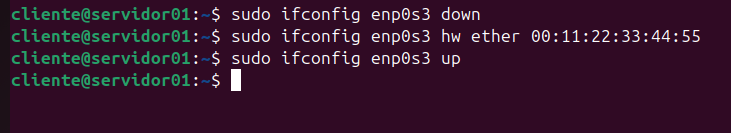

20. **Realiza una solicitud HTTP POST a `https://httpbin.org/post` enviando el usuario `admin` y la contraseña `12345` usando `curl`.**

    ```bash
    $ curl -sS -X POST -d "user=admin&password=12345" https://httpbin.org/post
    ```

    

21. **Consulta el nombre de dominio completo (FQDN) de tu sistema usando `hostname`.**

    ```bash
    $ hostname -f
    ```

    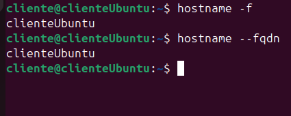

22. **Muestra solo las conexiones activas en la interfaz `eth0` usando `netstat`.**

    ```bash
    $ ss -tn src 192.168.1.100 or dst 192.168.1.100
    ```

    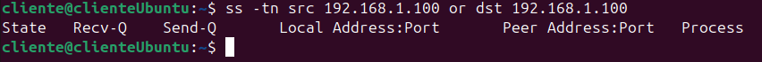

23. **Muestra las conexiones activas con nombres de dominio en lugar de direcciones IP usando `netstat`.**

    ```bash
    $ netstat -atp
    ```

    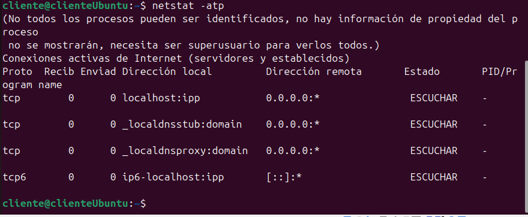

24. **Configura una nueva puerta de enlace predeterminada con la dirección `192.168.1.1` usando `ip route`.**

    ```bash
    $ sudo ip route add default via 192.168.1.1 dev eth0
    ```

    

25. **¿Qué comando usarías para ver todas las rutas configuradas en tu sistema?**

    ```bash
    $ ip route show
    ```

    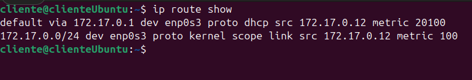

26. **¿Cómo configuras que todo el tráfico destinado a la red `10.10.10.0/24` pase por el gateway `192.168.1.1` en la interfaz `eth0`?**

    ```bash
    $ sudo ip route add 10.10.10.0/24 via 192.168.1.1 dev eth0
    ```

27. **¿Cómo eliminas la ruta añadida en el ejercicio anterior?**

    ```bash
    $ sudo ip route del 10.10.10.0/24 via 192.168.1.1 dev eth0
    ```

28. **Si la interfaz `eth0` está deshabilitada, ¿qué comando usarías para levantarla?**

    ```bash
    $ sudo ip link set enp0s3 up
    ```

29. **¿Qué comando utilizas para asignar la dirección MAC `02:1A:2B:3C:4D:5E` a la interfaz `eth0`?**

    ```bash
    $ sudo ip link set dev eth0 address 02:1A:2B:3C:4D:5E
    ```

    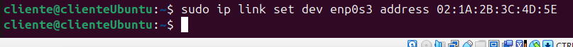

30. **¿Cómo renombrarías la interfaz `eth0` para que pase a llamarse `lan0`?**

    ```bash
    $ sudo ip link set eth0 name lan0
    ```

